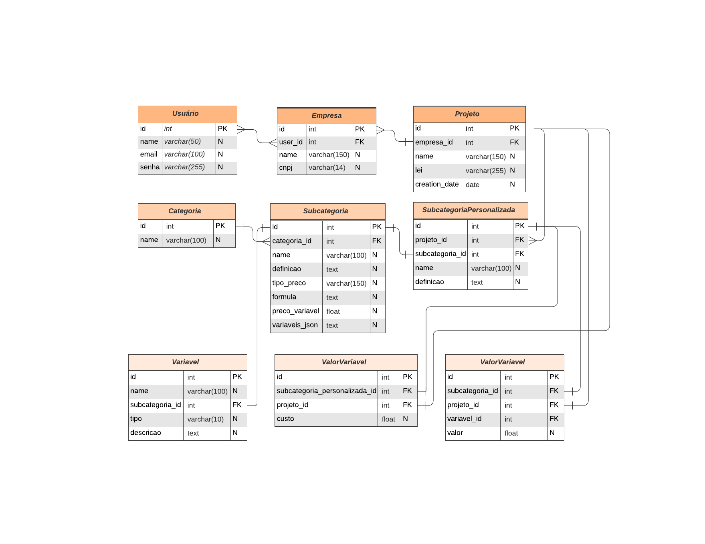

# Calculadora Regulatória

## Descrição
A **Calculadora de Impacto Regulatório** é uma aplicação web desenvolvida em Python com o framework Flask, destinada a auxiliar empresas na análise dos custos associados a regulamentações específicas. A ferramenta permite que os usuários calculem os custos de conformidade e financeiros diretos decorrentes de leis e regulamentações, proporcionando uma visão detalhada dos impactos financeiros em suas operações.

## Objetivos
- Fornecer uma ferramenta intuitiva para empresas e empresarios calcularem os custos associados a diferentes categorias e subcategorias de regulamentações.

- Permitir que os usuários personalizem as subcategorias de custos, adicionando instâncias específicas conforme suas necessidades.

- Facilitar a análise e a geração de relatórios detalhados sobre os custos regulatórios.

- Organizar os dados de forma eficiente, utilizando um banco de dados relacional para armazenamento e recuperação de informações.

## Funcionalidades

- Cadastro de Empresas e Projetos: Os usuários podem inserir o nome de sua empresa e a lei regulatória aplicável para cada projeto de análise.

- Seleção de Subcategorias de Custos: Possibilidade de escolher entre subcategorias de custos padrão ou adicionar subcategorias personalizadas.

- Entrada de Dados Personalizada: Coleta de informações específicas necessárias para cada cálculo, como valores de variáveis e quantidades.

- Cálculo Automático dos Custos: Realiza cálculos baseados nas fórmulas predefinidas para cada subcategoria, gerando os custos totais.

- Visualização de Resultados: Apresenta os resultados dos cálculos de forma organizada, permitindo ao usuário compreender facilmente os impactos financeiros.

- Exportação de Relatórios: Possibilidade de gerar relatórios em PDF dos resultados obtidos.

- Autenticação de Usuários (Futuro): Implementação planejada para que múltiplos usuários possam salvar e acessar seus projetos de forma segura.

## Arquitetura do Projeto

A aplicação é construída utilizando o padrão Model-View-Controller (MVC), organizado da seguinte forma:

Modelos: Definição das classes que representam as tabelas do banco de dados, utilizando SQLAlchemy.
Views: Templates HTML renderizados pelo Flask, utilizando Jinja2 para exibir as páginas da aplicação.
Controladores: Rotas Flask que processam as requisições, interagem com os modelos e renderizam as views.

## Esquema do Banco de Dados


O banco de dados é composto pelas seguintes tabelas principais:

- Usuário
- Empresa
- Projeto
- Categoria
- Subcategoria
- Subcategoria Personalizada
- Variável
- ValorVariável
- Custo

As tabelas estão relacionadas de forma a permitir a organização dos dados por usuários, empresas, projetos e subcategorias personalizadas, mantendo a flexibilidade e a escalabilidade da aplicação.

## Estrtura de Diretórios

Ideia inicial de estrutura (sujeito a mudanças)

```arduino
calculadora_impacto/
│
├── app.py
├── config.py
├── requirements.txt
├── .env
├── README.md
├── migrations/
│   └── ...
├── models/
│   ├── __init__.py
│   ├── categoria.py
│   ├── subcategoria.py
│   ├── subcategoria_personalizada.py
│   ├── variavel.py
│   ├── valor_variavel.py
│   ├── custo.py
│   └── ...
├── templates/
│   ├── base.html
│   ├── index.html
│   ├── resultado.html
│   ├── adicionar_subcategoria.html
│   └── ...
├── static/
│   ├── css/
│   │   └── styles.css
│   ├── js/
│   │   └── scripts.js
│   └── images/
│       └── ...
└── utils/
    ├── calculos.py
    └── helpers.py
```

Descrição dos Diretórios e Arquivos:

- app.py: Arquivo principal da aplicação Flask.
- config.py: Configurações da aplicação, como URI do banco de dados.
- requirements.txt: Lista de dependências do projeto.
- migrations/: Diretório usado pelo Flask-Migrate para migrações de banco de dados.
- models/: Contém os modelos do SQLAlchemy que representam as tabelas do banco de dados.
- templates/: Arquivos HTML que definem as páginas da aplicação.
- static/: Arquivos estáticos, como CSS, JavaScript e imagens.
- utils/: Módulos auxiliares, como funções de cálculo e helpers.